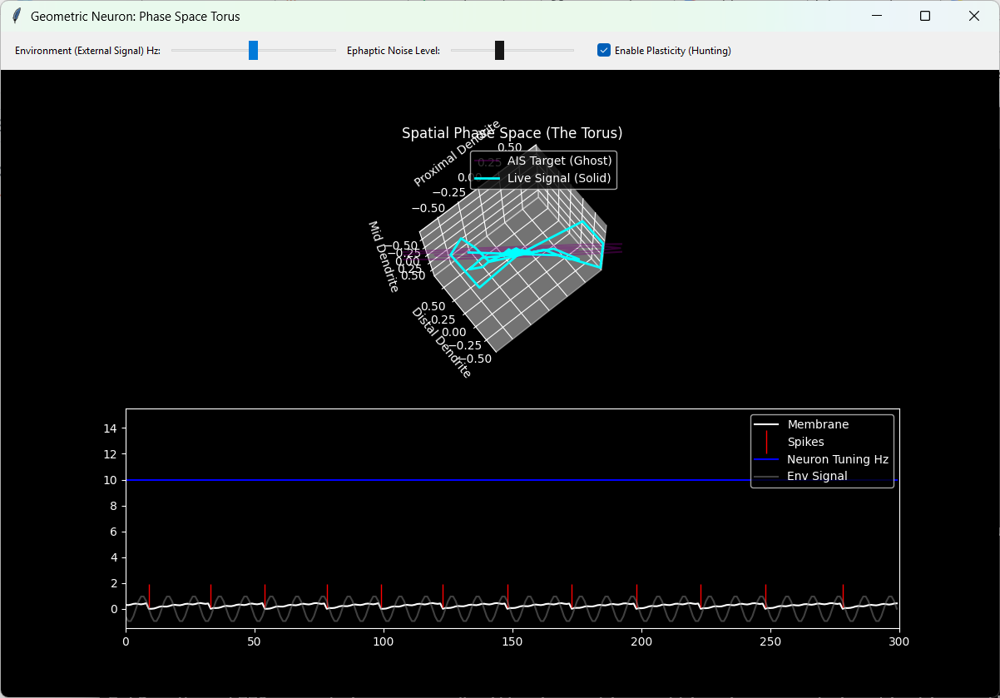

# The Geometric Neuron (v4)

Phase-Space Computation, Moiré Resonance, and the Death of the McCulloch-Pitts Approximation

# The Flaw in Modern AI

For 80 years, Artificial Intelligence has been built on a fundamental hallucination: the McCulloch-Pitts neuron. In standard Machine Learning (PyTorch, TensorFlow, LLMs), a neuron is treated as a scalar arithmetic node. It multiplies discrete inputs by learned numerical weights, sums them, and passes them through a non-linear activation curve.
This requires megawatts of GPU power to simulate what a human brain does on 20 watts. Why? Because the brain does not compute arithmetic. The brain computes geometry.

# The Core Discovery: Neurons as Moiré Interferometers

The Geometric Neuron (v4) is a physicalist, 1D wave-resonance computing core. It entirely strips away scalar weights, matrix multiplication, and backpropagation. It replaces them with the actual physical mechanics of neurobiology.

# The Dendrite is a Takens Phase-Space Unfolder

Signals in the brain arrive as 1D temporal waves. Standard AI treats these as discrete numbers. Real dendrites are physical, fluid-filled RC cables (capacitors/resistors). As a wave travels physically down the dendrite, the cable delays and attenuates the signal. Mathematically, this acts as a Takens' Delay Embedding, naturally unfolding a flat 1D temporal wave into a high-dimensional spatial geometry (an attractor) across the cell membrane.

# The AIS is a Physical Grating (Leterrier, 2018)

Modern biology reveals that the Axon Initial Segment (AIS) is not an arithmetic logic gate. It is a highly structured periodic scaffold of actin rings connected by spectrin tetramers, spaced exactly 190nm apart.

In the Geometric Neuron, the AIS acts as a Moiré interferometer. An action potential (spike) is not a mathematical threshold crossing—it is the physical event that occurs when the high-dimensional spatial wave on the dendrite geometrically aligns with the periodic physical spacing of the AIS grating.

# Learning Without Backprop: Morphological Plasticity

Real neurons do not use gradient descent to update floating-point weights. They alter their physical shape. If a Geometric Neuron is "starved" of geometric resonance, it triggers 
Morphological Plasticity. It physically lengthens or shortens its AIS grating, literally sweeping its resonant tuning frequency until the geometry of the environment perfectly fits through the spatial grating of the cell.

# Repository Structure

geom_neuronV4.py: The physicalist wave-resonance engine. A self-tuning biological cell that replaces nn.Linear.

phase_space_torus.py: A live 3D UI. Watch 1D signals physically unfold into complex Takens embeddings (Strange Attractors), and watch the cell physically stretch its internal geometry to 
hunt for phase-locks.

# How to Understand the UI

When you run the 3D Phase Space UI, you will see a purple "ghost" shape. This is the physical AIS grating of the neuron—its perfect spatial resonant state. You will see a cyan shape—this is the live environmental signal traveling down the dendrite.

If you feed the neuron a signal that does not match its geometry, the waves destructively interfere. The neuron remains silent.
If you feed it a signal it wants, the neuron's morphology will hunt and stretch until the cyan geometry slides perfectly inside the purple geometry. The membrane hits resonance, and the cell fires.

# We do not think in numbers. We think in geometry.
